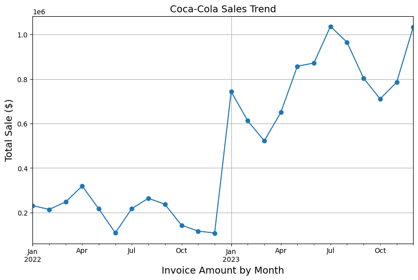
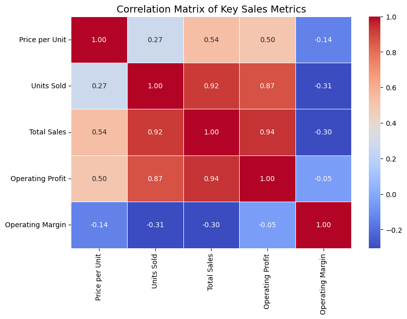

# 📊 Coca-Cola Sales Data Analysis

## Overview
This project performs **exploratory data analysis (EDA)** on Coca-Cola sales data to identify **sales trends, pricing behavior, profitability drivers, regional performance, and consumer insights** using Python visualizations and business-focused analysis.

---

## Table of Contents
- [Dataset](#dataset)
- [Tools Used](#tools-used)
- [Analysis Highlights](#analysis-highlights)
- [Key Visualizations](#key-visualizations)
- [Key Insights](#key-insights)
- [How to Run](#how-to-run)


---

## Dataset
- Coca-Cola sales data (CSV format)  
- Includes sales, pricing, profit, region, city, retailer, and invoice dates

---

## Tools Used
- Python  
- Pandas  
- NumPy  
- Matplotlib  
- Seaborn  

---

## Analysis Highlights
1. Sales trends and seasonality analysis  
2. Regional sales performance  
3. Beverage brand profitability  
4. Price vs units sold relationship  
5. Profitability by price range  
6. City-level consumer behavior  
7. Market segmentation by price sensitivity  
8. Retailer repeat purchase analysis  
9. Correlation analysis of key sales metrics  

---

## Key Visualizations
### Sales Trend Over Time


### Regional Sales Performance


### Price vs Units Sold


### Correlation Matrix


> 💡 *Note:* Full visualizations are available inside the notebook.

---

## Key Insights
- Strong **year-over-year growth** with clear seasonal peaks  
- **Mid-range pricing** generates the highest revenue and profit  
- Sales are driven more by **volume than price increases**  
- A small number of regions, cities, and retailers contribute most revenue  

---

## How to Run

```bash
1. Install required libraries:
   pip install pandas numpy matplotlib seaborn

2. Open the notebook:
   m_cocacola__sales_analysis.ipynb

3. Run all cells in Jupyter Notebook or Google Colab


Run all cells in Jupyter Notebook or Google Colab


